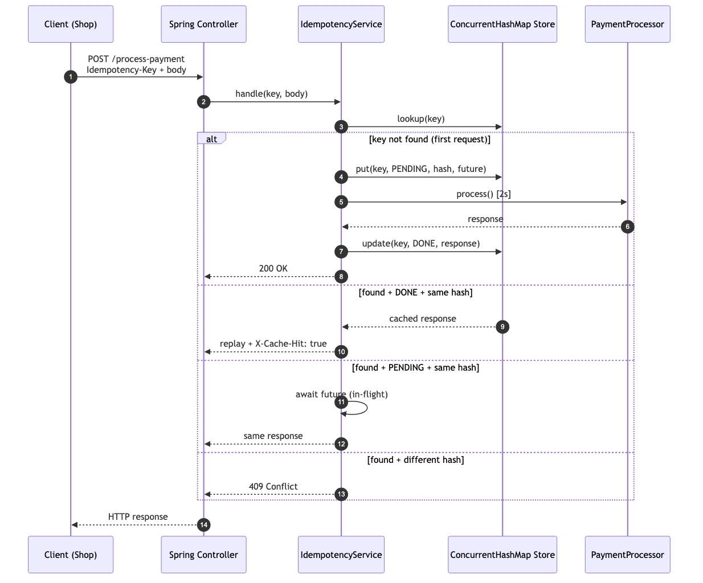

# Idempotency-Gateway

Retry-safe payment processing for FinSafe Transactions Ltd. An HTTP middleware that ensures a payment is processed **exactly once**, no matter how many times the client retries.

Built with **Java 17**, **Spring Boot 3.5.14**, Maven.

---

## The Problem

FinSafe's e-commerce clients sometimes experience network timeouts when calling the payment API. Their servers automatically retry, and FinSafe processes both requests — charging the customer twice.

This service sits in front of the payment processor. Clients attach an `Idempotency-Key` header to every request. Retries with the same key, replay the cached response instead of triggering a second charge.

---

## 1. Architecture Diagram



Five participants, four paths, one HTTP request:

| Participant                 | Role                                                                                                             |
| --------------------------- | ---------------------------------------------------------------------------------------------------------------- |
| **Client (Shop)**           | External system attaching the `Idempotency-Key` header                                                           |
| **Spring Controller**       | HTTP entry point — validates header + body, returns `ResponseEntity`                                             |
| **IdempotencyService**      | The decision-maker — looks up the key and routes the request to the right path: process, replay, wait, or reject |
| **ConcurrentHashMap Store** | In-memory cache behind the `IdempotencyStore` interface (Redis-ready)                                            |
| **PaymentProcessor**        | Stand-in for a real payment gateway — takes 2 seconds, then returns `"Charged X CCY"`                            |

Each request takes exactly one of four paths:

| Branch             | Trigger                                                        | Behavior                                                                       |
| ------------------ | -------------------------------------------------------------- | ------------------------------------------------------------------------------ |
| **First request**  | Key never seen                                                 | Reserve the key → process the payment → store the response → return 200        |
| **Replay**         | Key + body match a completed entry                             | Return cached response with an additional header `X-Cache-Hit: true`           |
| **In-flight wait** | Key + body match a _pending_ entry (original still processing) | Wait for the original request to finish, then return the same response         |
| **Conflict**       | Key matches but body differs                                   | Return 409 with `"Idempotency key already used for a different request body."` |

---

## 2. Setup Instructions (Quickstart)

### Prerequisites

- Java 17+ (project targets 17; tested on 17.0.15)
- No Maven install needed — you can use the Maven Wrapper (`mvnw`)

### Run

```bash
cd backend/Idempotency-gateway
./mvnw spring-boot:run
```

Server listens on `http://localhost:8080`.

### Test

```bash
./mvnw test
```

All **18 tests** pass:

```
Tests run: 18, Failures: 0, Errors: 0, Skipped: 0
BUILD SUCCESS
```

### Build a runnable jar

```bash
./mvnw package
java -jar target/idempotency-gateway-0.0.1-SNAPSHOT.jar
```

---

## 3. API Documentation

### Endpoint

```
POST /process-payment
```

### Request

| Where  | Name              | Required | Notes                                                                                                                                                     |
| ------ | ----------------- | -------- | --------------------------------------------------------------------------------------------------------------------------------------------------------- |
| Header | `Idempotency-Key` | Yes      | Client-generated unique value (UUID v4 recommended). **Reuse the same value on retries** of the same payment intent; generate a new one for a new intent. |
| Body   | `amount`          | Yes      | Positive `BigDecimal`                                                                                                                                     |
| Body   | `currency`        | Yes      | 3-letter ISO standard code (`GHS`, `USD`, …)                                                                                                              |

### Responses

| Status            | When                                     | Notable headers               |
| ----------------- | ---------------------------------------- | ----------------------------- |
| `200 OK`          | First request or replay                  | `X-Cache-Hit: true` on replay |
| `400 Bad Request` | Missing/blank header, validation failure | —                             |
| `409 Conflict`    | Same key, different body                 | —                             |

Error responses use a uniform `ApiError` shape:

```json
{
  "timestamp": "2026-05-17T12:34:56.789Z",
  "status": 409,
  "error": "Conflict",
  "message": "Idempotency key already used for a different request body.",
  "path": "/process-payment"
}
```

### Interactive docs

After `./mvnw spring-boot:run`:

- **Swagger UI** — http://localhost:8080/swagger-ui/index.html

---

## Worked Examples

### 1. First request — happy path

```bash
curl -i -X POST http://localhost:8080/process-payment \
  -H 'Content-Type: application/json' \
  -H 'Idempotency-Key: 550e8400-e29b-41d4-a716-446655440000' \
  -d '{"amount": 100, "currency": "GHS"}'
```

Response (~2 second wait):

```
HTTP/1.1 200
Content-Type: application/json

{"message":"Charged 100 GHS"}
```

### 2. Replay — same key, same body

Run the _same_ command a second time:

```
HTTP/1.1 200
Content-Type: application/json
X-Cache-Hit: true

{"message":"Charged 100 GHS"}
```

Returns immediately. The processor is **not** re-invoked.

### 3. Conflict — same key, different body

```bash
curl -i -X POST http://localhost:8080/process-payment \
  -H 'Content-Type: application/json' \
  -H 'Idempotency-Key: 550e8400-e29b-41d4-a716-446655440000' \
  -d '{"amount": 500, "currency": "GHS"}'
```

```
HTTP/1.1 409
Content-Type: application/json

{
  "status": 409,
  "error": "Conflict",
  "message": "Idempotency key already used for a different request body.",
  ...
}
```

### 4. In-flight wait — two parallel identical requests

```bash
curl -X POST http://localhost:8080/process-payment \
  -H 'Content-Type: application/json' \
  -H 'Idempotency-Key: inflight-demo' \
  -d '{"amount": 100, "currency": "GHS"}' & \
curl -X POST http://localhost:8080/process-payment \
  -H 'Content-Type: application/json' \
  -H 'Idempotency-Key: inflight-demo' \
  -d '{"amount": 100, "currency": "GHS"}' & wait
```

Both finish at ~2s wall-clock (not 4s); the second response carries `X-Cache-Hit: true`. The processor is invoked **once**.

### 5. Validation errors

```bash
# missing header
curl -i -X POST http://localhost:8080/process-payment \
  -H 'Content-Type: application/json' -d '{"amount":100,"currency":"GHS"}'
# → 400

# negative amount
curl -i -X POST http://localhost:8080/process-payment \
  -H 'Content-Type: application/json' \
  -H 'Idempotency-Key: x' -d '{"amount":-1,"currency":"GHS"}'
# → 400
```

---

## 4. Design Decisions

- **Money uses `BigDecimal`, not `double`.** Binary floats can't exactly represent decimals (`0.1 + 0.2 ≠ 0.3`). Fine for graphics, fatal for payments.
- **Plain data types are Java `records`.** Immutable, no hand-written getters / setters / `equals` / `hashCode` (the compiler generates them), idiomatic since Java 17.
- **Request bodies are hashed after sorting their fields.** `{"amount":100,"currency":"GHS"}` and `{"currency":"GHS","amount":100}` are the same request and must hash the same. SHA-256 over canonical JSON — Jackson is configured to alphabetize both record fields and `Map` keys before hashing.
- **The store sits behind an interface.** `IdempotencyStore` is the abstraction, the service depends on (the _Dependency Inversion Principle_). Swapping the in-memory implementation for Redis is a one-class change — Redis-native `EXPIRE` would make the sweeper unnecessary.
- **A single atomic claim ensures only one thread processes per key.** A store slot is either `Pending` (in progress) or `CachedResponse` (done) — modelled as a sealed type so the compiler forces us to handle both. `ConcurrentHashMap.putIfAbsent` picks the winning thread; the rest see the existing entry (the completed one). If processing fails, the slot is removed and waiters are unblocked — otherwise a dead `Pending` would hang every later retry forever.
- **Late arrivals share the winner's result.** They call `.get()` on the same `CompletableFuture` the winner will complete — one payment call serves N concurrent identical requests. The bonus user story falls out for free.
- **One place handles every error response.** A `@RestControllerAdvice` maps every failure case — 409 conflict, 400 body validation, 400 header validation — to the same `ApiError` shape.

- **One Duration format for both config binding and scheduling.** ISO strings like `PT24H` and `PT1H` work natively with `@ConfigurationProperties` and `@Scheduled(fixedDelayString)` — no custom parsing.

- **Gitflow with Conventional Commits.** `develop` is the integration branch; every feature is its own PR; release goes `develop → main`.

---

## 5. Developer's Choice — TTL Sweeper

The challenge invited one extra feature. We added a **scheduled cleanup job** that removes idempotency entries older than a configurable TTL.

### What it does

Every hour, a `@Scheduled` method asks the store to drop every entry whose `createdAt` is older than 24 hours.

### Why it matters

Without expiry, the in-memory store grows forever — 300 days of payments are 300 days of entries pinning memory. A real payment processor would also have **data-retention obligations** (don't keep payment details longer than necessary).

### Configuration

```yaml
idempotency:
  ttl: PT24H # 24 hours — how long a key remains replayable
  sweep-interval: PT1H # 1 hour  — how often the cleanup job runs
```

Both values are ISO `Duration` strings (`PT24H` = 24 hours, `PT30M` = 30 minutes, etc.). Override them in `application.yml` to retune for a different environment.

---

## Project Structure

```
backend/Idempotency-gateway/
├── docs/
│   └── architecture.png                ← sequence diagram
├── pom.xml                             ← Spring Boot 3.5.14, Java 17, springdoc 2.7.0
├── mvnw, mvnw.cmd, .mvn/               ← Maven Wrapper — no local Maven needed
├── src/main/
│   ├── java/com/amalitech/idempotency/
│   │   ├── IdempotencyGatewayApplication.java   ← @EnableScheduling, @ConfigurationPropertiesScan
│   │   ├── config/
│   │   │   ├── IdempotencyProperties.java       ← @ConfigurationProperties("idempotency")
│   │   │   └── OpenApiConfig.java               ← @Bean OpenAPI metadata
│   │   ├── controller/
│   │   │   └── PaymentController.java           ← @RestController POST /process-payment
│   │   ├── dto/
│   │   │   ├── PaymentRequest.java              ← record { amount, currency } + validation
│   │   │   └── PaymentResponse.java             ← record { message }
│   │   ├── exception/
│   │   │   ├── ApiError.java                    ← uniform error response shape
│   │   │   ├── IdempotencyConflictException.java
│   │   │   └── GlobalExceptionHandler.java      ← @RestControllerAdvice
│   │   ├── service/
│   │   │   ├── IdempotencyService.java          ← claim-or-await orchestration
│   │   │   ├── IdempotencyResult.java           ← record { entry, cacheHit }
│   │   │   ├── IdempotencyKeySweeper.java       ← @Scheduled TTL sweep
│   │   │   └── PaymentProcessor.java            ← simulated 2s payment work
│   │   ├── store/
│   │   │   ├── StoreEntry.java                  ← sealed { Pending, CachedResponse }
│   │   │   ├── Pending.java                     ← record { hash, future, createdAt }
│   │   │   ├── CachedResponse.java              ← record { status, body, hash, createdAt }
│   │   │   ├── IdempotencyStore.java            ← interface
│   │   │   └── InMemoryIdempotencyStore.java    ← @Component ConcurrentHashMap impl
│   │   └── util/
│   │       └── HashUtil.java                    ← SHA-256 over canonical JSON
│   └── resources/
│       └── application.yml                      ← port, ttl, sweep-interval
└── src/test/
    └── java/com/amalitech/idempotency/
        ├── controller/PaymentControllerIntegrationTest.java
        ├── service/IdempotencyServiceConcurrencyTest.java
        ├── service/IdempotencyKeySweeperTest.java
        ├── store/InMemoryIdempotencyStoreTest.java
        ├── util/HashUtilTest.java
        └── IdempotencyGatewayApplicationTests.java
```

---

## Future Work (Recommendations)

- **Redis backend** — implement `IdempotencyStore` against Redis. The interface is already shaped for this swap.
- **Official client SDK** — a tiny `finsafe-client` library that auto-generates UUIDs and reuses them across retries, so consumers don't have to get it right by hand and the real payment processor.

---

**Patrick Nshimiyimana** — [IDEMPOTENCY-GATEWAY](https://github.com/Patricknshimiyimana/AmaliTech-DEG-Project-based-challenges/tree/main/backend/Idempotency-gateway) - AmaliTech project-based challenge submission, 2026.
